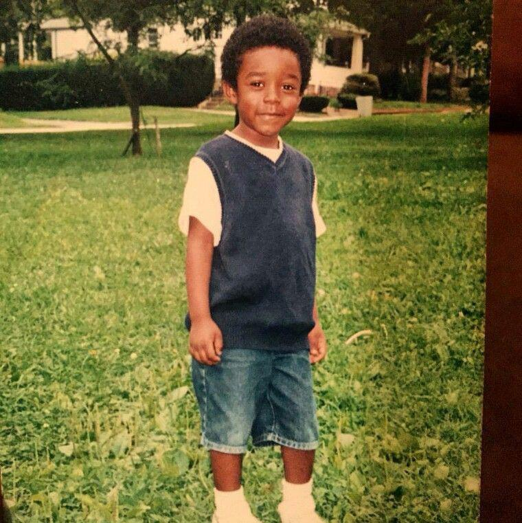
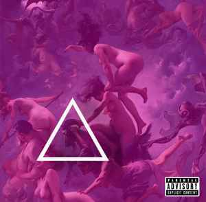
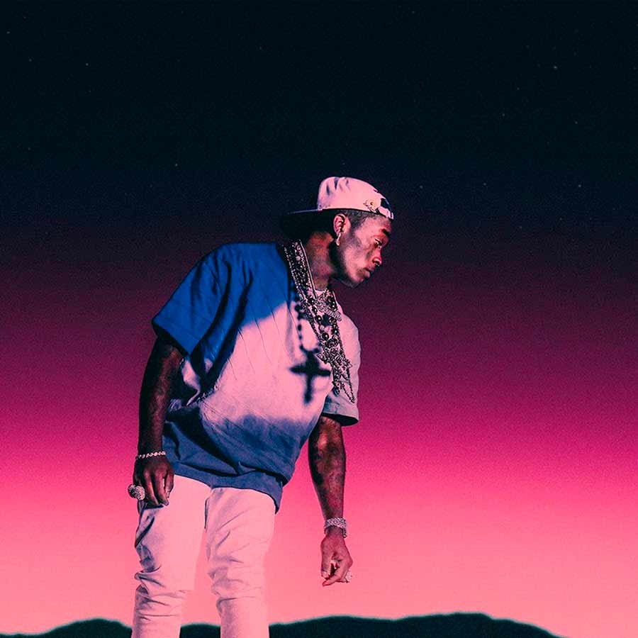

> *Para mi querido amigo Maximo y su familia*.

Antes de comenzar, si encuentran fallos de ortografía o algo es que, sinceramente, no he tenido muchas ganas de revisar muy bien el texto, solo quería soltar mi opinión sobre este polémico tema que no me deja dormir por las mañanas.

Teniendo todo esto claro, empecemos.

Pero antes de discutir sobre Lil Uzi, tenemos que primero saber quién es Lil Uzi (obvio).

## ¿Quién es Lil Uzi? Sus inicios y su carrera.

Lil Uzi Vert, o *Symere Woods* para los amigos, es un rapero y compositor estadounidense nacido el 31 de Julio del 1994 en el Norte de Filadelfia.

Más tarde, en su adolescencia, el pavo comenzó a escuchar a Wiz Khalifa y a Meek Mill, que influyeron fuertemente en su carrera musical de rap y estilo lírico. Woods, además, es muy fan de Marilyn Manson y cuenta que «Mechanical Animals» podría considerarse su álbum favorito. Otros grupos que el artista admiraba cuando tenía trece años y que fueron grandes influencias en su futuro musical fueron Paramore, My Chemical Romance y The All-American Rejects.

No fue hasta décimo grado (o cuarto de la ESO) cuando Woods comenzó a rapear, él mismo dijo que no le interesaba para nada el rap cuando era más pequeño, pero tras escuchar a su compañero de clase, William Aston, haciendo un freestyle sobre una instrumental de Chris Brown, cambió su forma de verlo. Woods, Aston y otro amigo crearon un grupo de rap Steaktown, y se separaron cuando Woods tenía 17 años.

Un poco más tarde abandonó la escuela y encontró trabajo en Bottom Dollar, que  apenas duró una semana ya que renunció después de cuatro días y fue expulsado de su casa por su madre. Fue esta situación la que llevó al artista a hacerse su primer tatuaje en el rostro, la palabra «Faith», que lo llevó a tomar en serio su carrera de rap.

Al principio comenzó a rapear bajo el nombre de «Vert», que para él significaba «vertical» como un «salto vertical». Fue ya más adelante cuando cambió su nombre definitivamente a Lil Uzi Vert, que nació por la forma en que alguien describió su fluidez a la hora de capear: «Rápido, como una ametralladora».

Su primer proyecto fue un EP llamado Purple Thoughtz Vol. 1, que fue lanzado en el año 2014. No lo he escuchado, así que no voy a opinar. Este álbum nos presentó a un Woods con un mayor enfoque lírico que la mayor parte de su carrera. Este EP fue lanzado con el single «White Shit» junto a un videoclip. El tema llamó la atención de fuertes pilares de la industria, como A$AP Mob.

Poco después el artista firmó con The Academy y produjo su primer mixtape: «The Real Uzi», lanzado el 5 de agosto de 2014 (3 dias antes de mi cumpleaños). Después de este lanzamiento firmó un contrato de grabación con Atlantic Records. Después de firmarlo, Lil Uzi Vert apareció en el single WDYW de Carnage con Rich the Kid y A$AP Ferg.

Woods lanzó su segundo mixtape, «Luv Is Rage» el 20 de octubre de 2015. Este proyecto fue recibido de forma muy positiva por parte del público y apareció en numerosos blogs y revistas de música como Fader, XXL y Vibe, incluso fue llamado «el artista emergente del año 2015» por HotNewHipHop.

Ya en abril de 2016, Uzi lanzó su tercer mixtape y primer mixtape comercial «Lil Uzi Vert vs. The World». El mixtape debutó en el número 37 en el Billboard 200, el proyecto pasó 55 semanas en la lista de álbumes y finalmente fue certificado como Oro. Lil Uzi y Kodak Black marcharon en una gira conjunta en mayo de 2016.

La explosión de su carrera fue en 2016, donde también se unió a la gira de The Weeknd, sacó un disco con Gucci Mane y además, estaba a punto de salir su mejor disco, «Luv Is Rage 2.» En febrero de 2017, Woods lanzó el EP Luv is Rage 1.5 mientras estaba de gira con The Weeknd. El EP fue muy bien recibido por su naturaleza «nerd» con instrumentales temáticos de Kingdom Hearts, letras que refieren al anime, Steven Universe y hentai.

La gran popularidad de XO Tour Llif3 en SoundCloud resultó en que Woods la tocó en vivo en Europa, en la gira junto a The Weeknd, y se convirtió en la canción más importante de los raperos y la canción más grande, y fue certificada seis veces como platino en agosto de 2018.

Lil Uzi Vert ha llegado a colaborar con grandes artistas admirados por él, como Pharrell Williams y Young Thug, y ha sido nominado a mejor artista en Billboard, Grammys y MTV VMA. A día de hoy, la popularidad del artista sigue aumentando y cuenta con más de 13 millones de seguidores en Instagram, más de 7 millones en Twitter y supera los 7 millones en YouTube.

## Mi sincera opinión de Lil Uzi Vert.

No puedo negar que Lil Uzi desde al año 2015 (Luv is Rage) hasta el 2020 (Eternal Atake) era bastante bueno. No era un artista que me encantaba pero tenía bastantes canciones buenas. Pero desde el 2021 para adelante: completo desastre. ¿Cómo puedes pasar de clásicos como POP, Silly Watch, Two, Sauce It Up, The Way Life Goes, Baby Are You Home, 20 min, XO Tour Llif3, Do What I Want, SideLine Watching, Erase Your Social, entre muchos más a "Pluto x Baby Pluto"? Es que no lo entiendo.

No soy hater de Lil Uzi pero vaya mierda de proyectos que está sacando últimamente. Pluto x Baby Pluto: BASURA. Está llena de canciones de mierda (no me lo he escuchado pero es que me da tanta cosa pensando que está Drankin N Smokin en el albúm que prefiero no perder el tiempo) del TikTok y nananana, aburridisimo. Y mira que me gusta Future y tal, pero esto no lo soporto.

Después tenemos un EP (RED & WHITE) que solo me gustó una canción, la de FLEX UP, el resto, es que son una completa basura. Y lo digo otra vez, no soy hater de Lil Uzi, pero esto no puede ser. Muy aburrido, monótono y es que no es interesante.

Meses después sacó Just Wanna Rock, que era una canción leakeada pero bueno, esta está decente supongo no me voy a quejar y poco después, un feature con Fousheé que está bastante bien (en verdad prefiero la canción sin Lil Uzi pero no me quejo).

Pero lo que me mató de verdad es cuando sacó un remix de un pavo random de Internet de su canción Watch This. Es que no puede ser. Encima sacó como 2 versiones, una slowed y otra sped. Se vé que este pavo ya solo le importan las visitas y no la música ni el arte (como a Playboi Carti, a él si que le importa la música, sus fans y saca música de calidad muy seguido).

Para terminar, terminó sacando Pink Tape con unos "Pink Tape: Level 1, 2, 3..", pero esto que mierda es bro. Si quieres visitas cómprate bots pero no resubas el álbum 5 veces y lo llames "Pink Tape: Level no se que". Qué falta de respeto para la industria de verdad.

Resumiendo, Lil Uzi Vert flopped y ya está. R.I.P.

Gracias por leer y que tengan buena noche.